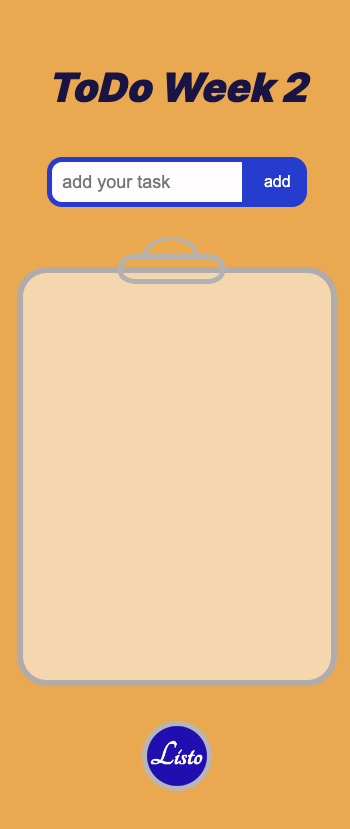

# ToDoList

# Listo an easy to use Todo List App. 
(./img/images/ListoBG.png)

This is a basic Todo list application built with [JavaScript](https://developer.mozilla.org/en-US/docs/Web/JavaScript) that allows users to manage their tasks effectively.

## Features

- **Add Tasks:** Easily add new tasks to your list.
- **Mark as Complete:** Check off tasks when they are done.
- **Delete Tasks:** Remove tasks that are no longer needed.
- **Persistence:** Your tasks are saved locally, so you won't lose them when you refresh the page.

## Technologies Used

- HTML
- CSS
- JavaScript

## Usage

To use the application, simply open the `index.html` file in your web browser.

1. **Add a Task:** Type your task into the input field and press Enter or click the "Add" button.
2. **Mark as Complete:** Click on the checkbox next to the task to mark it as complete.
3. **Delete a Task:** Click on the delete icon (trash can) to remove the task from the list.

## Demo

[View Demo]  https://paolo-mad.github.io/ToDoList/

## Screenshots

[Todo List App desktop](./img/images/desktop.png)

## Contributing

Contributions are welcome! If you'd like to improve this Todo list app, please fork the repository and create a pull request. Feel free to open an issue if you encounter any bugs or have suggestions for enhancements.

## License

This project is licensed under the [MIT License](LICENSE).

---

Feel free to tailor this README to fit the specific details of your Todo list app, including screenshots, live demo links, and any additional features or technologies used.
